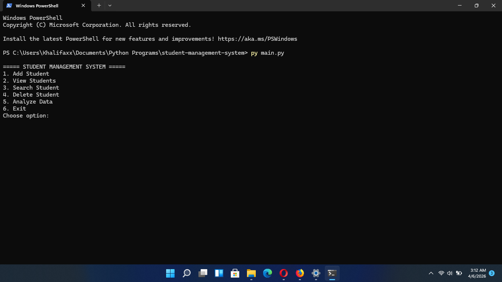
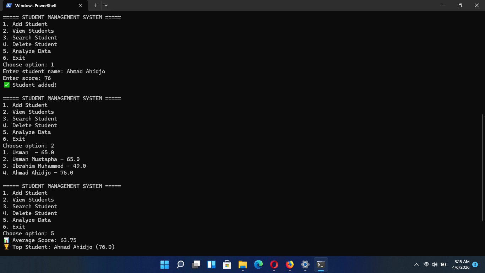

# Student Management System

## 📌 Problem
Managing student records manually can be difficult. This system helps store and analyze student data easily.

## 🚀 Features
- Add student
- View students
- Search student
- Delete student
- Analyze data (average & top student)

## 🛠️ How to Run
```bash
python main.py

📊 Data Handling

Data is stored in a JSON file (students.json). The program loads and updates this file dynamically.

🧠 Core Logic
Students stored as list of dictionaries,
Functions handle each operation,
Data processed using loops and built-in functions

📷 Outputs

## 📷 Screenshots




---

## 📑 Presentation

[Download Presentation](presentation.pdf)

---

## 📊 Data File

[View Sample Data](students.json)

👨‍💻 Author

Mustapha Usman Khalifa
